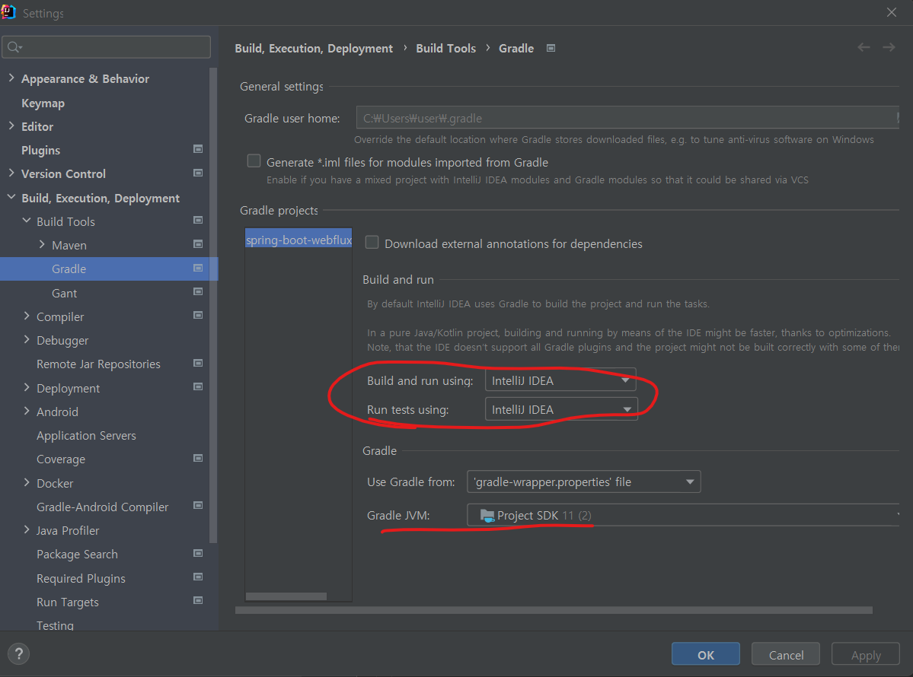
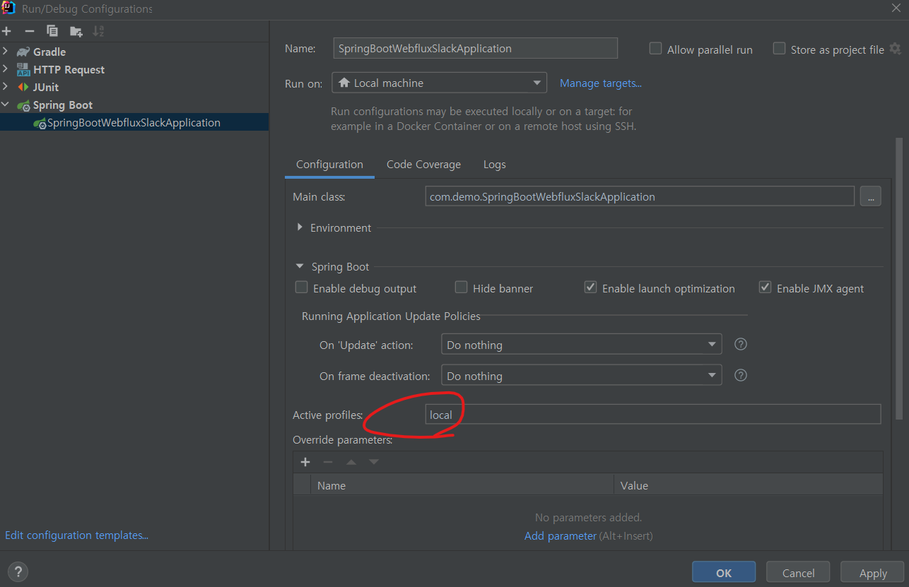

# spring-boot-webflux-slack
webflux + spring-security skeleton code 작성하여, 기본 사용법 습득하기

## 로컬 환경 설정
* intellij
    1. before build (```SDK version : openjdk 11```)
       > 
    2. build error
       ````
       터미널에서 build 오류시 - gradle invalid source release: 11
       - gradle.properties 생성 후 본인의 java home 추가
       - 예시 : org.gradle.java.home=C:\\Program Files\\ojdkbuild\\java-11-openjdk-11.0.13-1 
       ````
    3. after build
       > 


## 개발 적용 사항
* spring-boot 2.4.11
    * spring-webflux 관련 기본 설정들
        1. local profile - h2 db (postgre mode) 설정
        2. lombok
        3. custom banner - init banner 설정
        4. spring profile - 배포를 위한 환경별 프로파일 설정 (spring include file 설정)
        5. gitignore - 불필요한 커밋 파일 제외 설정
        6. 기본 config 설정
            1. spring-secruity 설정
            2. cors 설정
            3. swagger 설정
    * test case
        1. .http 파일로 테스트 케이스 구성
    * gradle
        1. dependency 및 jar 생성을 위한 내용 작성
    * docker
        1. 도커환경에서 프로파일별 jar 실행 시키기 내용 작성
      
* restful-api
    * restful sample api 개발
* 외부 api 연동 개발
    * slack client
    * gmail client


## 참고 레퍼런스
1. [Spring Documentation](https://docs.spring.io/spring-framework/docs/current/reference/html/web-reactive.html)
2. [Spring WebClient 사용법1](https://umbum.dev/1114)
3. [Spring WebClient 사용법2](https://medium.com/@odysseymoon/spring-webclient-%EC%82%AC%EC%9A%A9%EB%B2%95-5f92d295edc0)
4. [Spring Security Webflux](https://sthwin.tistory.com/24)
5. [Spring Swagger Webflux](https://github.com/pgilad/spring-boot-webflux-swagger-starter)

    